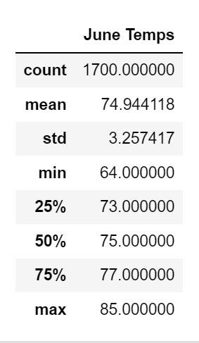
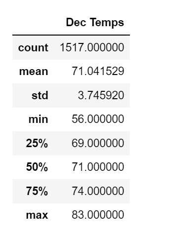

# Surfs Up Weather Analysis

## Project Overview

The purpose of this project was to review weather patterns in Hawaii to determine the feasibleness of opening a surf and ice cream shop in that location. This project focused on the weather temperatures in June and December. The idea was to compare varying statistical data between the two periods to assess whether the shop would have enough pleasant weather conditions in which to operate.

## Results

The following table summarizes June's temperature statistics over several years:

The next table summarizes December's temperature statistics over several years:

These two tables tell us the differing weather patterns for the two monthly periods. Conclusions based on the information provided by the tables are as follows:
- The average temperatures between June and December are 75 and 71 degrees respectively, which show a moderate temperature with little fluctuation between the two periods from an average standpoint.
- The maximum temperatures of 85 degrees (June) and 83 degrees (December) are also remarkably similar.
- Minimum temperatures for these months, 64 degrees (June) and 56 degrees (December), show the greatest variance. It reflects a much lower temperature level in December that may not be conducive for ice cream or surfing. However, with standard deviations of 3.25 (June) and 3.74 (December) we would expect a little more variation in the December numbers.

## Summary

Overall, the weather in June and December are historically similar in comparison, although December has more deviations in temperature-the high being close to June's, but its low well below June's.
Additional queries that could be run include: Precipitation differences between June and December to determine if one has more rainy weather and comparisons by weather station, as we may see higher/lower temperatures and precipitation levels at various locations. The weather station closest to our prospective location would be of the highest interest to us, which would narrow down the results and provide the best data for us to consider.
